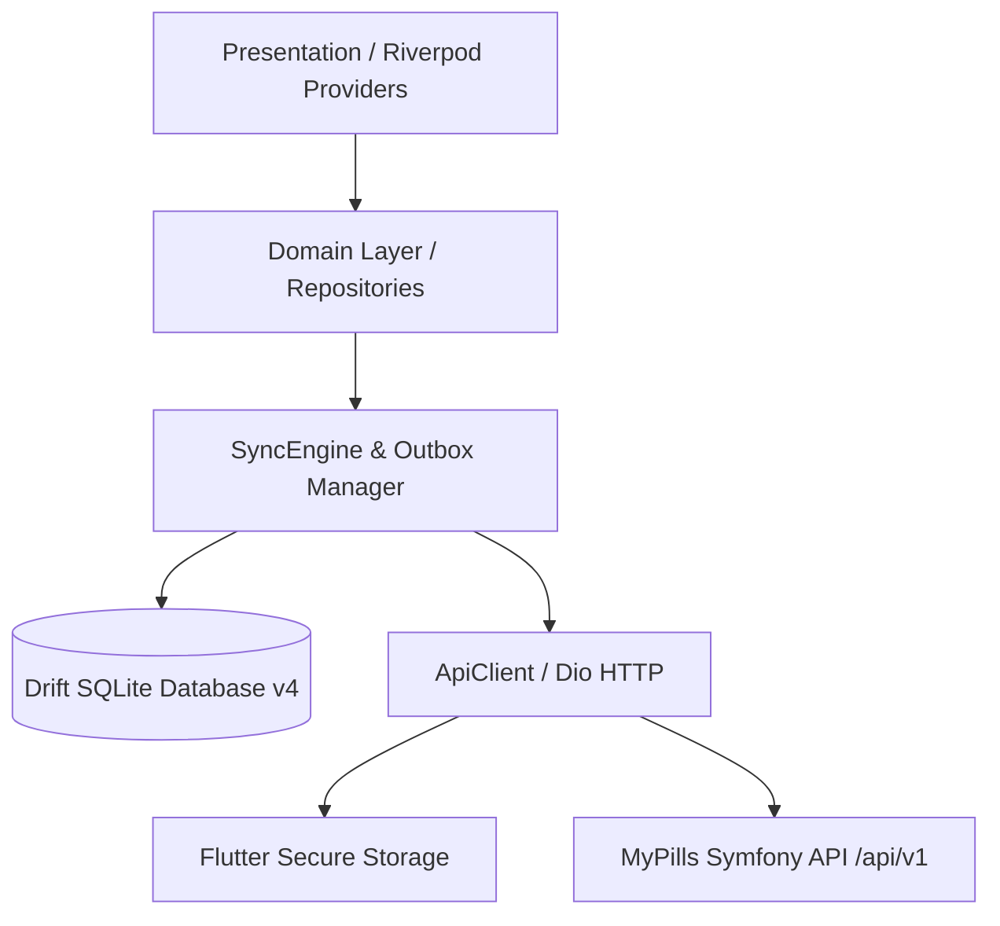
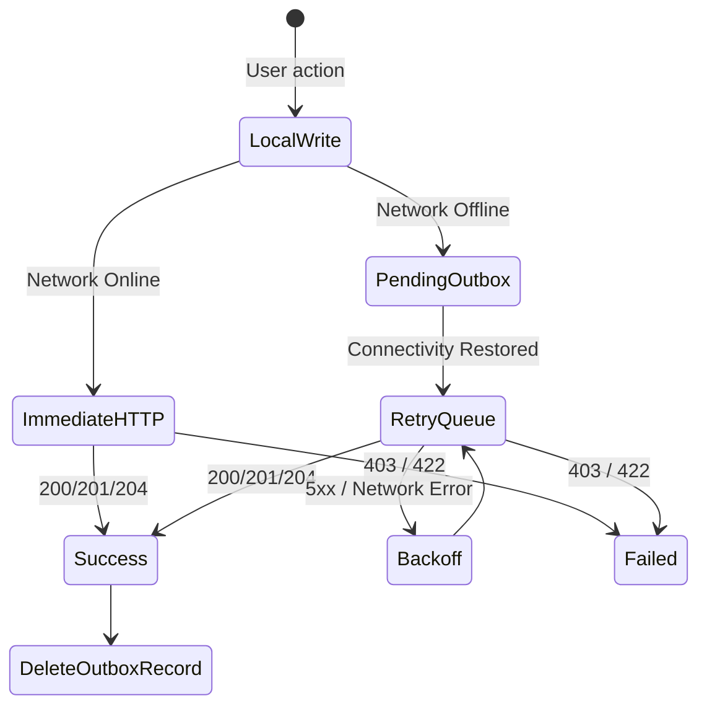
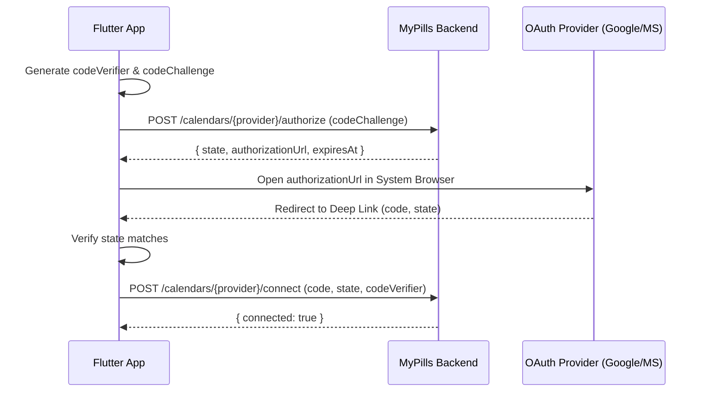

# Technical Design: MyPills Backend Integration

## 1. System Architecture Overview



## 2. Component File Map

```
lib/
  core/
    network/
      api_client.dart            # Dio instance + single-flight mutex token refresh
      api_exceptions.dart        # Server error envelope mapping
    storage/
      token_storage.dart         # flutter_secure_storage access/refresh token cache
    db/
      app_database.dart          # Drift SQLite schema v4
      outbox_table.dart          # Outbox queue table schema
    sync/
      sync_engine.dart           # Delta sync algorithm & outbox flusher
  features/
    auth/
      data/repositories/auth_repository_impl.dart
      domain/entities/auth_user.dart
      domain/repositories/auth_repository.dart
    profile/
      data/repositories/synced_profile_repository.dart
    medications/
      data/repositories/synced_medications_repository.dart
    schedules/
      data/repositories/synced_schedules_repository.dart
    tracker/
      data/repositories/synced_dose_events_repository.dart
    notifications/
      data/services/fcm_device_service.dart
    calendar_integration/
      data/services/pkce_calendar_service.dart
```

## 3. Network & Auth Interceptor Guard

```dart
// Single-flight token refresh mutex flow
if (err.response?.statusCode == 401 && !isRefreshEndpoint) {
  final success = await refreshTokenSingleFlight();
  if (success) {
    return retryOriginalRequest();
  } else {
    await tokenStorage.clearTokens();
    emitUnauthenticatedState();
  }
}
```

## 4. Outbox Offline Operation State Machine



## 5. Sync Engine Delta Algorithm

1. Send `GET /api/v1/profiles/{profileId}/sync?since=<lastSyncIso>`.
2. Start Drift DB Transaction:
   - Insert / Update `medications` array.
   - Insert / Update `schedules` array.
   - Insert / Update `doseEvents` array.
   - Process `tombstones` array (set `isTombstone = true` or delete local rows).
3. Commit Transaction.
4. Save `nowIso` timestamp to `SharedPreferences` key `sync_cursor_profile_<profileId>`.

## 6. PKCE Calendar Authorization Sequence


